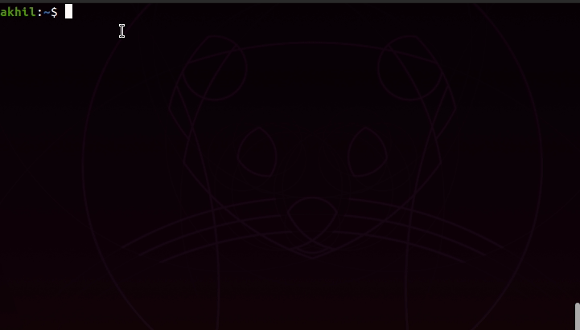

## Build Flask App
An easy to use flask app generator that allows users to create flask apps simply by running one command.

### Install using source code
To download the app generator, you can clone this repository to your local machine.
```
$ git clone https://github.com/kouul/build-flask-app
$ cd build-flask-app
```

### Install using pip3
```
$ pip3 install build-flask-app
```
Package @ PyPI repository: https://pypi.org/project/build-flask-app/

### Usage
Ensure that you have flask installed on your environment. You can install flask using _pip3 install flask_.
```
$ build-flask-app app_name
$ cd app_name
$ python3 app.py
```


Open up http://localhost:5000/ to see your Hello World app.

### Arguments

| Args  | Definition Usage |
| ------------- | ------------- | Definition |
| -d  | Debugger Mode on  | $ python3 build-flask-app.py app_name -d |
| -cj  | Css and Javascript mode on  | $ python3 build-flask-app.py app_name -cj |

Below is a list of arguments you can pass when building your flask application.
##### Enable Debug Mode
You can enable debug mode on while creating your flask app by using the option **-d** or **--debugger**
```
$ python3 build-flask-app.py app_name -d
```

##### Import style.css and app.js
You can import stylesheet and javascript file automatically while creating the app using **-cj** or **--css-js** option
```
$ python3 build-flask-app.py app_name -cj
```

##### Import bootstrap CDN
You can import bootstrap automatically via the CDN using **-bs** or **--bootstrap** option
```
$ python3 build-flask-app.py app_name -bs
```

##### Import jQuery CDN
You can import jQuery automatically via the CDN using **-jq** or **--jquery** option
```
$ python3 build-flask-app.py app_name -jq
```

##### Import Gsap CDN
You can import Gsap automatically via the CDN using **-gsap** or **--gsap** option
```
$ python3 build-flask-app.py app_name -gsap
```

##### Create Dockerfile and docker-compose script
You can push the app to a docker container instead of running it locally. Simply use **-dc** or **--docker-container** option. Please note that the image generated in Dockerfile is *python:3.7-alpine*. You might want to change this to the non-alpine version for big projects
```
$ python3 build-flask-app.py app_name -dC
```


### Coming features
- [ ] Manual(--help)
- [x] Debug option on (-d)
- [x] Include Stylesheet and Script (-cj)
- [x] Push app to docker container (-dc)
- [x] Import bootstrap css library (-bs)
- [ ] Import jQuery library (-jq)
- [ ] Import gsap js framework (-gsap)
- [ ] Deploy on heroku (-hK)

Feel free to create issue in case something is not working :)