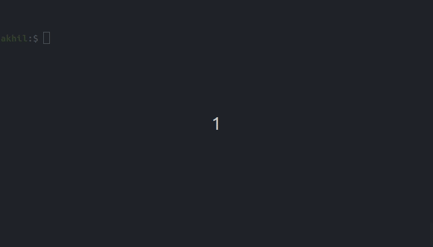

## Create Flask App
An easy to use flask app generator that allows users to create flask apps simply by running one command.

### Get started
To download the app generator, you can clone this repository to your local machine.
```
$ git clone https://github.com/kouul/create-flask-app
$ cd create-flask-app
```

### Usage
Ensure that you have flask installed on your environment. You can install flask using _pip3 install flask_.
```
$ python3 create-flask-app.py app_name
$ cd app_name
$ python3 app.py
```


Open up http://localhost:5000/ to see your Hello World app.

#### Set to path variable(Optional)
```
$ cp create-flask-app.py /usr/local/bin/
$ chmod +x /usr/local/bin/create-flask-app.py
```
After setting environment variable, you should be able to run _create-flask-app.py_ from anywhere on your pc

### Arguments
- ##### Enable Debug Mode
    You can enable debug mode on while creating your flask app by using the option **-dB**
    ```
    $ python3 create-flask-app.py app_name -dB
    ```

- ##### Import style.css and app.js
    You can import stylesheet and javascript file automatically while creating the app using **-sS** option
    ```
    $ python3 create-flask-app.py app_name -sS
    ```

- ##### Create Dockerfile and docker-compose script
    You can push the app to a docker container instead of running it locally. Simply use **-dC** option. Please note that the image generated in Dockerfile is *python:3.7-alpine*. You might want to change this to the non-alpine version for big projects
    ```
    $ python3 create-flask-app.py app_name -dC
    ```


### Coming features
- [ ] Manual(--help)
- [x] Debug option on (-dB)
- [x] Include Stylesheet and Script (-sS)
- [x] Push app to docker container (-dC)
- [ ] Deploy on heroku (-hK)

Feel free to create issue in case something is not working :)