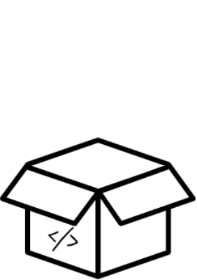
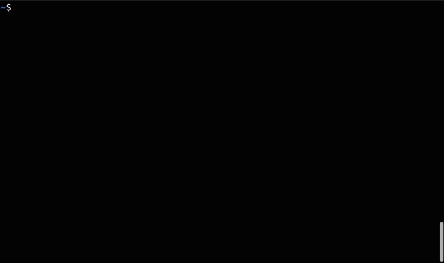

## Build Flask App

An easy to use flask app generator that allows users to create flask apps simply by running one command. You can check out the official website [here](https://buildflaskapp.kouul.website).

<p align="center">

</p>

### Install using pip/pip3
```
$ pip3 install buildflaskapp
```
Package @ PyPI repository: https://pypi.org/project/buildflaskapp/

### Usage
Ensure that you have flask installed on your environment. You can install flask using _pip3 install flask_.
```
$ buildflaskapp app_name
$ cd app_name
$ python3 app.py
```


Open up http://localhost:5000/ to see your Hello World app.

### Arguments

Args | Usage | Definition
------------ | ------------- | -------------
-d | $ buildflaskapp app_name -d | debugger mode on
-sl3 | $ buildflaskapp app_name -sl3 | sqlite3 mode on
-cj | $ buildflaskapp app_name -cj | import style.css and app.js
-bs | $ buildflaskapp app_name -bs | import bootstrap cdn
-jq | $ buildflaskapp app_name -jq | import jQuery cdn
-gsap | $ buildflaskapp app_name -gsap | import GSAP cdn
-fa | $ buildflaskapp app_name -fa | import Font Awesome cdn
-dc | $ buildflaskapp app_name -dc | containerize app in docker

Below is a list of arguments you can pass when building your flask application.
##### Enable Debug Mode
You can enable debug mode on while creating your flask app by using the option **-d** or **--debugger**
```
$ buildflaskapp app_name -d
```

##### Enable SQLite3 Mode
You can set sqlite3 configuration while creating your flask app by using the option **-sl3** or **--sqlite3**
```
$ buildflaskapp app_name -sl3
```

##### Import style.css and app.js
You can import stylesheet and javascript file automatically while creating the app using **-cj** or **--css-js** option
```
$ buildflaskapp app_name -cj
```

##### Import bootstrap CDN
You can import bootstrap automatically via the CDN using **-bs** or **--bootstrap** option
```
$ buildflaskapp app_name -bs
```

##### Import jQuery CDN
You can import jQuery automatically via the CDN using **-jq** or **--jquery** option
```
$ buildflaskapp app_name -jq
```

##### Import Gsap CDN
You can import Gsap automatically via the CDN using **-gsap** or **--gsap** option
```
$ buildflaskapp app_name -gsap
```

##### Import Font Awesome CDN
You can import Font Awesome automatically via the CDN using **-fa** or **--font-awesome** option
```
$ buildflaskapp app_name -fa
```

##### Create Dockerfile and docker-compose script
You can push the app to a docker container instead of running it locally. Simply use **-dc** or **--docker-container** option. Please note that the image generated in Dockerfile is *python:3.7-alpine*. You might want to change this to the non-alpine version for big projects
```
$ buildflaskapp app_name -dC
```


### Features
- [x] Manual(--help)
- [x] Debug option on (-d)
- [x] SQLite3 option on (-sl3)
- [x] Include Stylesheet and Script (-cj)
- [x] Push app to docker container (-dc)
- [x] Import bootstrap css library (-bs)
- [x] Import jQuery library (-jq)
- [x] Import gsap js library (-gsap)
- [x] Import font awesome library (-fa)
- [ ] Import zurb foundations library (-zb)
- [ ] Import angular js library (-an)
- [ ] Deploy on heroku (-hK)

Feel free to create issue in case something is not working :)

<p align="center">

</p>